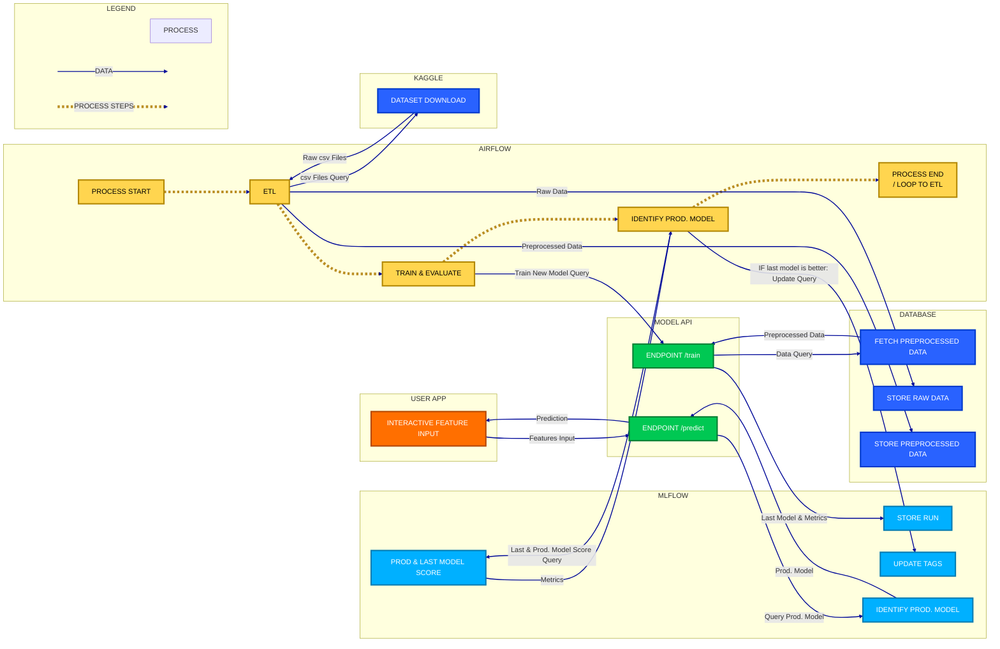

# 🚗 Road Accidents Severity Prediction - France

## 🎯 Project Goal

This MLOps project demonstrates a **production-grade machine learning pipeline** for predicting the severity of traffic accidents in France. The system helps emergency services and traffic management authorities prioritize response efforts by predicting accident outcomes based on environmental, temporal, and participant characteristics.

**Key Objectives:**
- Build an end-to-end MLOps pipeline with orchestration, monitoring, and serving capabilities
- Predict accident severity (Unscathed, Light injury, Hospitalized, Killed) from 16 features
- Implement model versioning, drift detection, and automated retraining workflows
- Provide a production-ready REST API with JWT authentication and Prometheus metrics

## 📊 Dataset

**Source**: [Accidents in France from 2005 to 2016](https://www.kaggle.com/datasets/ahmedlahlou/accidents-in-france-from-2005-to-2016/data) (Kaggle)

**Description**: Historical road accident data from the French government containing detailed information about accidents, vehicles, and users involved. The dataset includes:
- **Features**: 16 columns including temporal (year, month, hour), environmental (weather, luminosity, road type), and demographic factors (age, sex, user category)
- **Target**: Severity with 4 classes (1=Unscathed, 2=Light injury, 3=Hospitalized, 4=Killed)
- **Size**: 11+ years of accident records
- **Split**: 60% train, 20% validation, 20% test (stratified sampling)

## ↪️ Architecture Overview

<!-- Mermaid.js script copied from the most up to date version in src/utils/schemas.py -->



## 🗂️ Project Organization

The project is structured as follows:
```plaintext
.
├── README.md                  <- Project overview and setup instructions
├── docker-compose.yml         <- Multi-container orchestration (8 services)
├── Dockerfile.*               <- Service-specific container definitions
├── Makefile                   <- Common development commands (up, down, build, test)
├── pyproject.toml             <- Python dependencies and project metadata
├── requirements-*.txt         <- Service-specific Python requirements
│
├── .env                       <- Environment variables (create from .env.example)
├── .github/                   <- GitHub configuration and AI agent instructions
│
├── airflow/                   <- Airflow-specific files
│   ├── config/                <- Airflow configuration (airflow.cfg)
│   ├── logs/                  <- DAG execution logs and reports
│   └── plugins/               <- Custom Airflow plugins
│
├── configs/                   <- Service configurations
│   ├── grafana/               <- Grafana dashboards and provisioning
│   └── prometheus/            <- Prometheus scraping configuration
│
├── dags/                      <- Airflow DAG definitions
│   ├── accidents_data_dag.py  <- ETL pipeline for data ingestion
│   ├── accidents_ml_dag.py    <- ML training and evaluation pipeline
│   └── accidents_dag.py       <- Combined ETL + ML orchestration
│
├── data/
│   ├── raw/                   <- Original data from Kaggle (timestamped)
│   └── clean/                 <- Processed data ready for modeling
│
├── models/                    <- Saved model artifacts (if not in MLflow)
├── notebooks/                 <- Jupyter notebooks for exploration
├── references/                <- Data dictionaries and documentation
├── scripts/                   <- Utility scripts (DB seeding, entrypoints)
│
├── src/                       <- Source code for the project
│   ├── __init__.py
│   ├── api/                   <- FastAPI application
│   │   └── main.py            <- REST endpoints (/predict, /health, /metrics)
│   ├── auth/                  <- JWT authentication and user management
│   ├── data/                  <- Data processing scripts
│   │   ├── download_data.py   <- Kaggle dataset download
│   │   ├── clean_data.py      <- Data cleaning and merging
│   │   └── ingest_data.py     <- Database ingestion with progress tracking
│   ├── features/              <- Feature engineering (currently unused)
│   ├── models/                <- Model training and prediction
│   │   ├── train_model.py     <- Training with GridSearchCV
│   │   ├── predict_model.py   <- Prediction logic and model loading
│   │   └── metrics.py         <- Custom metrics and evaluation
│   ├── monitoring/            <- Drift detection and explainability
│   │   ├── drift.py           <- Evidently-based drift detection
│   │   ├── drift_reporter.py  <- Report generation and storage
│   │   └── explainability.py  <- SHAP values and model interpretation
│   ├── streamlit/             <- User-facing Streamlit application
│   │   ├── Home.py            <- Main entry point
│   │   └── pages/             <- Multi-page app components
│   └── utils/                 <- Shared utilities
│       ├── ml_utils.py        <- Central ML config and constants
│       ├── database.py        <- DB connection and progress tracking
│       ├── logging.py         <- Logging configuration
│       └── schemas.py         <- Pydantic models and data schemas
│
└── tests/                     <- Test suite
    └── unit/                  <- Unit tests mirroring src/ structure
        ├── api/
        ├── data/
        ├── models/
        ├── monitoring/
        └── utils/
```

## 🛫 Prerequisites

> everything that has to be done once before starting development.

0. install [UV](https://docs.astral.sh/uv/getting-started/installation/)
1. install python and its dependencies:
   ```bash
   uv sync
   ```
2. install [Docker](https://docs.docker.com/get-docker/).
3. create `.env` from the `.env.example` file and adapt values if needed

## 🚀 Quick Start

Get the entire MLOps pipeline running in 3 commands:

```bash
uv sync && source .venv/bin/activate  # Install dependencies
cp .env.example .env                  # Configure environment
make build && make up                 # Start all services
```

**Access Services:**
| Service | URL | Default Credentials |
|---------|-----|---------------------|
| Airflow UI | http://localhost:8080 | `airflow` / `airflow` |
| MLflow Tracking | http://localhost:5001 | - |
| FastAPI Docs | http://localhost:8000/docs | JWT token required |
| Streamlit UI | http://localhost:8501 | - |
| Grafana | http://localhost:3000 | `admin` / `admin` |
| MinIO Console | http://localhost:9000 | `mini_user` / `mini_password` |

## ⌨️ Development Setup

> Do this every time you start working on the project.

1. Sync dependencies and activate virtual environment:
   ```bash
   uv sync
   source .venv/bin/activate
   ```
2. Start 🐳 Docker containers:
   ```bash
   make build  # Build images with BuildKit
   make up     # Start containers in detached mode
   ```
3. Verify all services are healthy:
   ```bash
   docker ps  # Check container status
   make logs  # Follow container logs
   ```


## 🪁 Airflow DAGs

The project includes the following Airflow DAGs for orchestrating workflows:

- [accidents data dag](./dags/accidents_data_dag.py): Manages chunked or full data ingestion. This allows for simulating data evolution over time.
- [accidents ml dag](./dags/accidents_ml_dag.py): Handles the machine learning pipeline, including data cleaning, dataset splitting, model training and evaluation.
- [accidents dag](./dags/accidents_dag.py): Orchestrates the ETL pipeline for data ingestion, cleaning, and model training.


## 📊 Model Training Details

### 🧪 Validation Strategy

- **Static train/validation/test splits**: 60% / 20% / 20%
- **Stratified sampling**: Ensures balanced class distribution
- **Database-tracked**: Split assignments stored in `clean_data.dataset_split` column
- **Reproducible**: Fixed random seed (42) for consistent splits

### 🧮 Model & Metrics

- **Model**: Random Forest Classifier with 100 trees
- **Metrics**: Accuracy, Precision, Recall, F1-score (weighted), ROC-AUC
- **Artifacts**: Model, metrics, feature importance, confusion matrix, config

## 🖥️ Local Development (Without Docker)

For faster iteration during development:

**1. Start the API locally:**
```bash
uvicorn src.api.main:app --reload
```

**2. Start the Streamlit App:**
```bash
PYTHONPATH=. streamlit run src/streamlit/Home.py
```

**3. Access at:**
- API: http://localhost:8000/docs
- Streamlit: http://localhost:8501

**Note**: Ensure PostgreSQL, MLflow, and MinIO containers are running for database and model access.

## 📚 Additional Resources

- **Architecture Diagram**: See mermaid flowchart above for data flow
- **API Documentation**: Interactive docs at `/docs` endpoint (FastAPI auto-generated)
- **Model Training**: See `src/models/train_model.py` for standalone training script
- **DAG Documentation**: Detailed docstrings in `dags/*.py` files